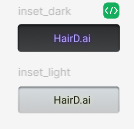
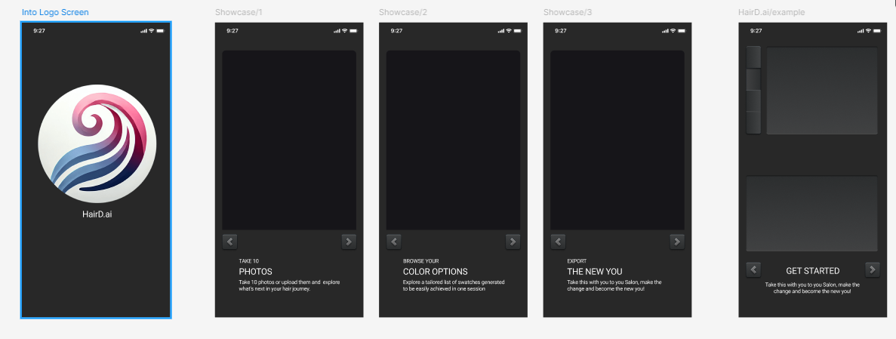
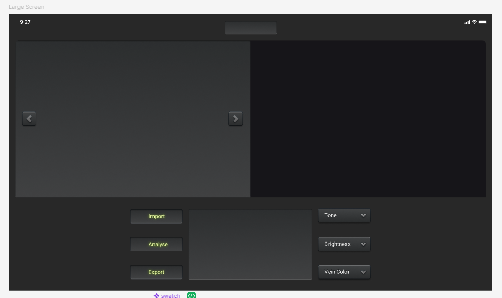
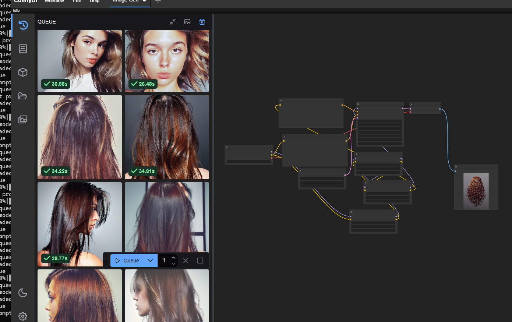

# HairD.ai

**Hair scanner and color advice for at-home or salon dyeing.**

---

## Description

HairD.ai helps users make realistic and informed decisions when choosing to dye their hair at home or have it professionally colored in a salon. Currently, this app only supports dyeing your hair for the first time. We are working toward developing features to support previously dyed or highlighted hair in the future.

### Key Features:

- **Photo Upload**: Users upload 20 photos of their hair in its current state.
- **Color Selection**: Select a target color you want to achieve.
- **Personalized Advice**: Explore achievable options for your hair.
- **Try-On Feature**: View your hair with the selected color in a preview image (_experimental_).

_**Disclaimer**: Always consult with a professional hairstylist. HairD.ai provides guidance, but professionals may achieve results beyond the app's recommendations at higher costs or through multiple sessions._

---

## MVP

- Upload photos of the current hair state.
- Receive tailored hair color advice based on a single dye session.

---

## Tech Stack

### **Design**:

- Figma (UI Design) ([View Design on Figma](https://www.figma.com/design/JzsGgUyJXgZwd1jFNINP0v/HairD.ai?node-id=0-1&t=bnPaphQKCko9XtXy-1))
- Photoshop (Logo and swatch creation)
- ChatGPT (Logo mockups)
- ComfyUI (Node-based image generation for hair visuals)

### **Frontend**:

- Vite
- React
- Tailwind CSS
- ESLint / Prettier
- React Dropzone (Drag-and-drop image uploads)

### **Backend**:

- Node.js (Express)
- Cloudinary (Image storage and optimization)
- Sharp (Image processing)

---

## Getting Started

For detailed setup instructions, refer to the following READMEs:

- [Frontend README](./client/README.md)
- [Backend README](./server/README.md)

---

## Project Configuration

### **Code Quality Tools**:

- **ESLint**: Ensures consistent code quality across the project.
- **Prettier**: Formats code for better readability.
  - Prettier configuration is specified in the root `package.json`.

### Repository Details

- **GitHub URL**: [HairD.ai Repository](https://github.com/dripstaltd/HairD.ai)
- **Bug Tracking**: [Report Issues](https://github.com/dripstaltd/HairD.ai/issues)

---

## Data Sources

Pre-built hair color charts provide data for:

- Hair color levels (e.g., lightness 1-10, tone variations).
- Matching user input with realistic results.

---

## Design Notes

### UI & UX

The app was initially designed with a dark theme in Figma. However, user testing showed a preference for a bright, professional design. Future updates will focus on reworking the CSS with **Tailwind CSS** to implement a clean and modern interface.

### Photoshop Swatches

Creating accurate lightness levels for hair swatches.

### AI Image Generation

Using **ComfyUI** to generate realistic hair visuals.

### Image Processing with Sharp

- **Purpose**: Sharp is used to analyze image brightness and calculate a "base level" for hair shades.
- **How It Works**:
  1. Fetch the uploaded image.
  2. Convert it to a buffer and analyze it using Sharp.
  3. Calculate the brightness and map it to a scale of 1 to 10 for realistic shade predictions.

### Image Upload and Transformation with Cloudinary

- **Purpose**: Cloudinary manages image storage and applies transformations like cropping, grayscale conversion, and blurring.
- **How It Works**:
  1. Upload base64-encoded images with a preset.
  2. Automatically apply transformations (e.g., crop to center, grayscale, blur).

---

## Next Steps

## Contributing

Contributions are what make the open source community such an amazing place to learn, inspire, and create. Any contributions you make are greatly appreciated.

If you have a suggestion that would make this project better, please fork the repo and create a pull request. You can also simply open an issue with the tag "enhancement." Don't forget to give the project a star! Thanks again!

### Steps to Contribute

1. Fork the Project
2. Create your Feature Branch (`git checkout -b feature/AmazingFeature`)
3. Commit your Changes (`git commit -m 'Add some AmazingFeature'`)
4. Push to the Branch (`git push origin feature/AmazingFeature`)
5. Open a Pull Request

- Add tonal variations, not just brightness level swatches.
- Support for highlighted and previously colored hair.
- Enhance support for high-lift tints.
- Implement color try-on using [Tensorflow.js](https://www.tensorflow.org/js) or [Magic API Hair](https://api.market/store/magicapi/hair).
- User login to save searches and uploads.
- Allow users to track their hair-dying sessions for progress history.
- Add video guide tutorials.
- Create a better UI tailored to the target audience.
- Enable photo editing with cropping and overlays.
- Allow users to delete bad images before generating results.
- Inform users about achievable results with extra sessions and provide helpful advice.
- Provide an easy way for contributors to share their suggestions or help improve the project.

---

Thank you for checking out HairD.ai! If you have any questions or feedback, feel free to reach out.
